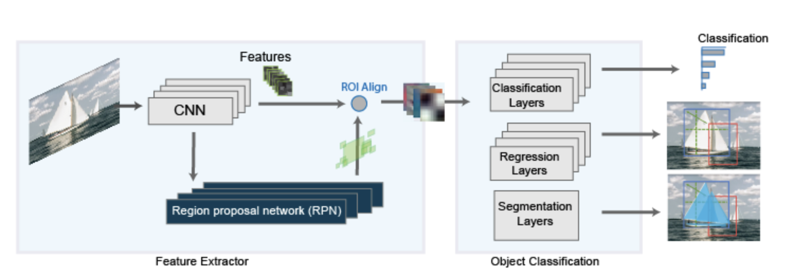

# Instance Segmentation Using Mask-RCNN

This reprository demonstrates training a Mask-RCNN network to perform instance 
segmentation and running an inference on a few test images. The network is trained 
on **two classes - 'Person' and 'Car'** using the COCO 2014 dataset.

## Minimum Requirements

This repository has the following minimum requirements-

- [MATLAB R2020b](https://uk.mathworks.com/products/matlab.html) or later
- [Deep Learning Toolbox](https://uk.mathworks.com/products/deep-learning.html)
- [Computer Vision Toolbox](https://uk.mathworks.com/products/computer-vision.html)

## 3rd Party Requirements

Running the network training code from this repository, needs the following -


- [COCO 2014 datset (images and annotations)](https://cocodataset.org/#download)
- [COCO API](https://github.com/cocodataset/cocoapi)

## Overview

Instance segmentation is computer vision technique which involves detection and 
localization of objects while simultaneously generating a segmentation map for 
each of the detected instances.


There are several deep learning algorithms for instance segmentation, the most 
popular being Mask-RCNN. The Mask-RCNN network belongs to RCNN family of networks 
and builds on the Faster-RCNN network to perform pixel level segmentation on the
detected objects.
The Mask-RCNN network uses a Faster-RCNN network with - 
- A more accurate sub-pixel level ROI pooling layer - ROIAlign
- A Mask branch for pixel level object segmentation.


## Perform Instance Segmentation using Mask-RCNN

### Setup

1. Add path to the source directory -

`addpath('./src/);`

2. Download and load the pre-trained network -

```
datadir = tempdir;
url = 'https://www.mathworks.com/supportfiles/vision/data/maskrcnn_pretrained_person_car.mat';

helper.downloadTrainedMaskRCNN(url, datadir);
pretrained = load(fullfile(datadir, 'maskrcnn_pretrained_person_car.mat'));
net = pretrained.net;

% Extract Mask segmentation sub-network
maskSubnet = helper.extractMaskNetwork(net);
```


### Predict

Perform prediction using the `detectMaskRCNN` function-

```
img = imread('visionteam.jpg');
executionEnvironment = "gpu";

[boxes, scores, labels, masks] = detectMaskRCNN(net, maskSubnet, img, params, executionEnvironment);

% Visualize results
overlayedImage = insertObjectMask(img, masks);
figure, imshow(overlayedImage)
showShape("rectangle", gather(boxes), "Label", labels, "LineColor",'r')

```

## Training

To train your Mask-RCNN network, follow the steps outlined in the following examples.

- MaskRCNNTrainingExample.mlx - Example showing how to train the Mask-RCNN network.
- MaskRCNNParallelTrainingExample.mlx - Example showing how to train the Mask-RCNN network on multiple GPUs.

### Helpers

This repository provides the following files to help create and train Mask-RCNN networks-

- src/CreateMaskRCNNConfig - Function to create a configuration structure for Mask-RCNN.
- src/CreateMaskRCNN - Function to create a Mask-RCNN netwwork with a resnet-101 backbone.
- detectMaskRCNN - Function to perform inference on Mask-RCNN network.

## References

K. He, G. Gkioxari, P. Dolla ́r, and R. Girshick. Mask R-CNN. In ICCV, 2017.

## Note

* "This network was trained using the COCO dataset, which was collected by the COCO Consortium (cocodataset.org)."
